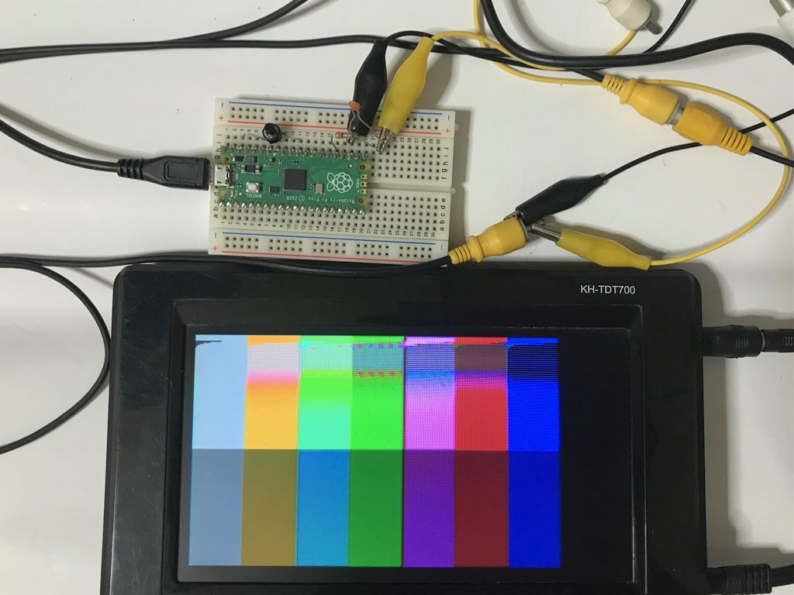
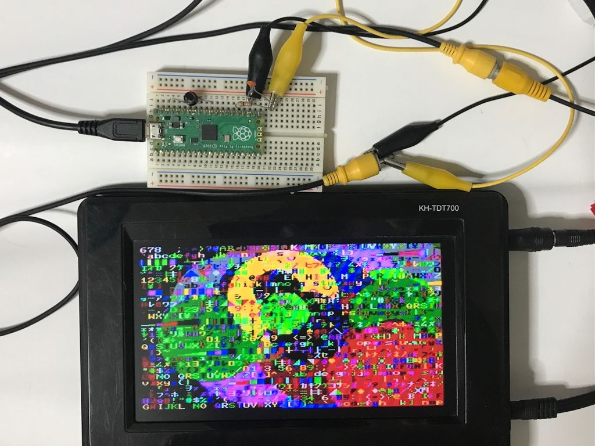

# NTSC Video output for Raspberry Pi Pico　(Text and Graphic)
Raspberry Pi PicoのPWM出力のみでNTSCビデオ出力する実験です。  
らびやん氏の以下を参考に作成しました。  
https://gist.github.com/lovyan03/b50333fa917371bd92b4b5f2e7a67e89  
テキストとグラフィックの重ね合わせ出力を行っています。  
チラつきが多いので実用には向いていないかもしれません。  
  
Raspberry Pi PicoのC SDKで作成し直し、ライブラリ化したものを公開しました。こちらのほうがチラつきが改善しています。  
https://github.com/KenKenMkIISR/rp2040_pwm_ntsc_textgraph2  
## 接続
GP19（25番ピン）から映像信号が出力されます。  
グランドとGP19を直接映像機器のビデオ入力に接続しただけで映ることもありますが、GP19と映像機器の間に75Ω程度の抵抗をはさみ、グランドとの間に560pF程度のコンデンサを入れたほうがチラつきが減る場合があるようです。  
  
GP19 -- 75 ohm --- Video Out  
　　　　　　　　|  
　　　　　　　=== 560 pF  
　　　　　　　　|  
　　　　　　　GND  
  
  
  
